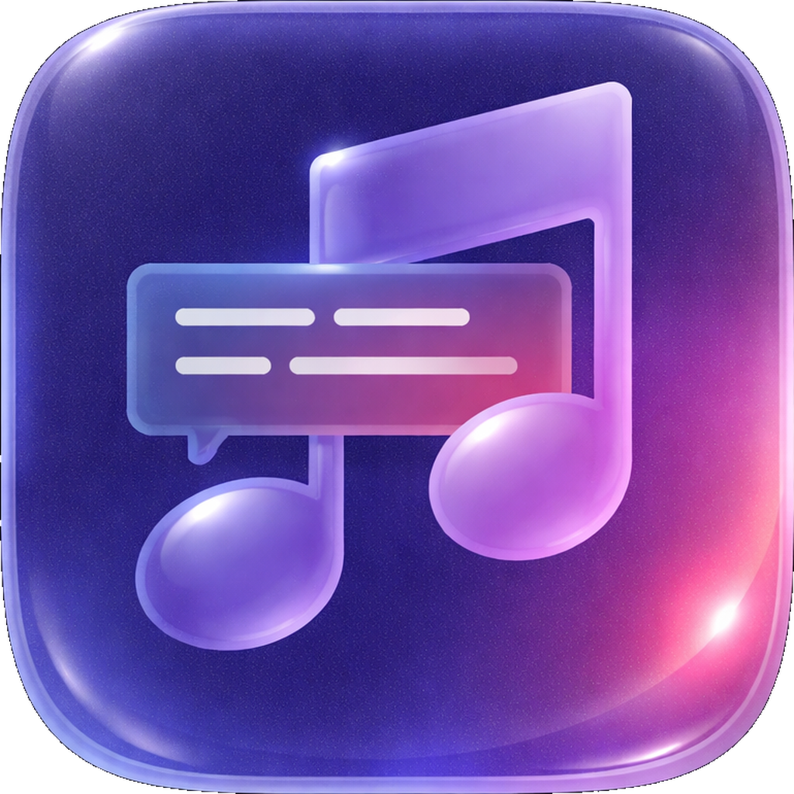

<p align="center">
  
  <h1 align="center">yalyric</h1>
  <p align="center"><b>Yet Another Lyric</b> — real-time Spotify & Apple Music lyrics on your macOS desktop</p>
</p>

<p align="center">
  
  
  <a href="LICENSE"></a>
  <a href="https://github.com/Question406/yalyric/actions"></a>
  <a href="https://github.com/Question406/yalyric/releases"></a>
</p>

<!-- TODO: Add a GIF showing lyrics syncing across display modes -->

A native macOS app that syncs lyrics from Spotify and Apple Music to your desktop. Auto-detects which player is active. Lightweight, no Electron, no web views. Inspired by [LyricsX](https://github.com/ddddxxx/LyricsX).

## Features

- **Three display modes** — floating overlay, desktop widget, and menu bar, all independently togglable
- **Four lyrics sources** — LRCLIB, Spotify Internal, Musixmatch, NetEase Cloud Music, queried in parallel
- **Karaoke fill effect** — gradient sweep across the current line in sync with the music
- **Six theme presets** — Classic, Neon, Minimal, Karaoke, Spotify, Terminal, plus full customization
- **Five transition styles** — slide up, crossfade, scale fade, push, or none
- **Draggable positioning** — move the overlay and widget anywhere on screen
- **Spotify + Apple Music** — auto-detects which player is active, seamless switching
- **Auto-hide** — overlay fades out when music is paused
- **Language filtering** — auto-detects song language, filters mismatched lyrics
- **Manual offset** — adjust lyrics timing with +/- buttons
- **Disk cache** — instant lyrics on songs you've played before
- **Smart matching** — validates search results by name/artist/duration to prevent wrong-song lyrics
- **Podcast/DJ filtering** — hides lyrics UI for non-music content, shows title in menu bar
- **Native Swift/AppKit** — ~65MB RAM, no dock icon, lives in the menu bar

## Installation

### Homebrew (recommended)

```bash
brew tap Question406/tap
brew install --cask yalyric
```

### Download

1. Download `yalyric.zip` from [Releases](https://github.com/Question406/yalyric/releases)
2. Unzip and drag `yalyric.app` to `/Applications`
3. Remove the quarantine flag (required for unsigned apps):
   ```bash
   xattr -cr /Applications/yalyric.app
   ```

### Build from Source

```bash
git clone https://github.com/Question406/yalyric.git
cd yalyric
swift build && .build/debug/yalyric
```

Or build the .app bundle:
```bash
./scripts/bundle.sh
# Output: dist/yalyric.app
```

## Quick Start

1. Launch yalyric — a **music note icon** appears in your menu bar
2. Play a song in Spotify or Apple Music — lyrics appear automatically
3. **Left-click** the menu bar icon to see the full lyrics popover
4. **Right-click** for Settings, Move Overlay, and Quit
5. First launch shows a welcome message; subsequent launches go straight to lyrics

## Display Modes

| Mode | Description |
|---|---|
| **Floating Overlay** | Always-on-top transparent window with current + next line. Click-through. Dynamic width. Draggable via right-click menu. |
| **Desktop Widget** | Sits on the wallpaper layer showing 3-9 lines (configurable) with the current line highlighted. Frosted glass background. |
| **Menu Bar** | Shows the current lyric line in the menu bar. Left-click opens a popover with full scrolling lyrics and karaoke fill. |

## Lyrics Sources

All four providers are queried in parallel. The best result wins based on scoring (synced > unsynced, language match, line count):

| Source | Auth | Best For |
|---|---|---|
| [LRCLIB](https://lrclib.net) | None | English/Western music. Free, open API. |
| Spotify Internal | SP_DC cookie | Exact match with Spotify's own lyrics. Spotify tracks only. |
| Musixmatch | Auto-token | Large synced subtitle database. |
| NetEase Cloud Music | None | CJK (Chinese/Japanese/Korean) music. |

Provider order is configurable via drag-to-reorder in Settings.

### Spotify Internal Setup (optional)

For the highest quality lyrics match:

1. Open [open.spotify.com](https://open.spotify.com) in your browser and log in
2. Open DevTools (F12) → Application → Cookies
3. Copy the `sp_dc` cookie value
4. Paste it into yalyric Settings → Sources → SP_DC Cookie

LRCLIB works without any configuration.

## Settings

Three tabs: **General**, **Appearance**, and **Sources**.

**General** — Display modes, auto-hide behavior, lyrics timing offset, widget line count, language preference

**Appearance** — Theme presets, font/size/spacing, text color, shadow, background style/opacity/radius, transition style/duration, karaoke fill toggle + edge softness, overlay position/width

**Sources** — Drag-to-reorder provider priority, SP_DC cookie, duration tolerance

## FAQ

**Does it work with Apple Music?**
Yes! yalyric auto-detects whether Spotify or Apple Music is playing and syncs lyrics from whichever is active. If both are playing, Spotify takes priority. Note: the Spotify Internal lyrics source only works with Spotify tracks — Apple Music tracks use the other three providers (LRCLIB, Musixmatch, NetEase).

**Why does it say "yalyric is damaged"?**
macOS quarantines unsigned apps. Run `xattr -cr /Applications/yalyric.app` to fix it. This is safe — the app is open source and you can verify the code.

**Why no lyrics for some songs?**
Some songs don't have synced lyrics in any database. You'll see "No lyrics available" with the track name. You can also check the log at `~/Library/Logs/yalyric.log` for details on which providers were tried.

**Does the desktop widget use WidgetKit?**
No. WidgetKit doesn't support real-time updates (it's limited to timeline-based refreshes). The widget is a native `NSWindow` at the desktop level — the same approach used by LyricsX and similar apps.

**Does it work in DJ mode?**
Yes. Lyrics sync to whatever track is currently playing. DJ transition interludes and podcasts are automatically filtered out.

## System Requirements

- macOS 13 (Ventura) or later
- Spotify desktop app and/or Apple Music

## Testing

```bash
swift test
```

71 tests across 6 suites covering LRC parsing, lyrics scoring, sync engine, offset, theme equality, TOML parsing, and gradient calculations.

## Contributing

Contributions are welcome! See [CONTRIBUTING.md](CONTRIBUTING.md) for setup instructions and guidelines.

Check the [roadmap](docs/plans/roadmap.md) for planned features, or look for issues labeled `good first issue`.

Some areas that would benefit from help:
- Keyboard shortcuts
- Word-level karaoke (Level 2)
- Local .lrc file support
- Album art color extraction

## Disclaimer

All lyrics are the property and copyright of their respective owners. yalyric fetches lyrics from third-party APIs for personal use only. This project is not affiliated with Spotify, Musixmatch, or any lyrics provider.

## License

[Apache License 2.0](LICENSE)
